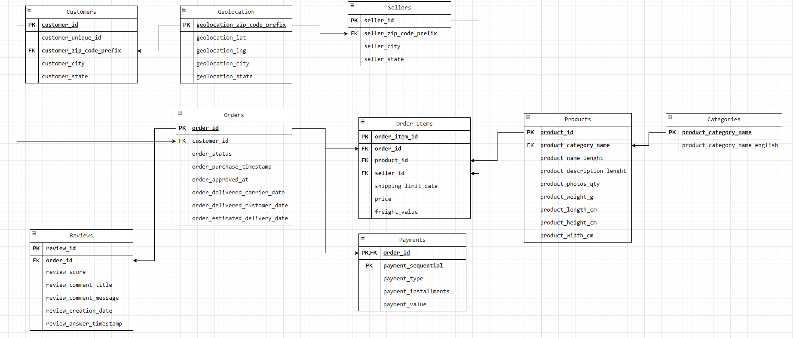

# 🛒 E-Commerce Intelligence Platform

> Business-Driven Data Analytics & Data Science on Real-World E-Commerce Data

---

## 🚀 Project Overview

This platform simulates how a modern analytics team extracts real business value from raw e-commerce data.  
It provides **practical solutions** to core business challenges:
- Understand business performance with KPIs
- Analyze customer behavior & churn
- Optimize pricing, retention, and growth

Built as a production-practical portfolio project during university holidays.

---

## 💡 Business Challenges Addressed

- Finding high-value customer segments
- Predicting and reducing customer churn
- Measuring the effect of pricing/discounts
- Turning raw data into actionable business metrics

---

## 🎯 Core Objectives

- Track and visualize key E-Commerce KPIs
- Segment customers for tailored action
- Identify main revenue/product drivers
- Foundation for prediction and experiments

---

## 📈 Main KPIs

- **Revenue & Growth Rate**
- **Average Order Value (AOV)**
- **Customer Lifetime Value (CLV)**
- **Churn Rate**
- **Repeat Purchase Rate**
- **Net Promoter Score (NPS / proxy via review data)**

---

## 🔑 Business Questions Answered

- Who are the most valuable customers?
- What signals predict churn?
- Which products are frequently bought together?
- Do discounts improve retention among at-risk users?
- How do reviews impact repeat business?

---

## 📊 Analytics & Data Science Workflows

- Exploratory Data Analysis (EDA)
- Automated KPI pipelines
- Customer segmentation (RFM, clustering)
- Market Basket Analysis (Apriori)
- Churn prediction (Random Forest)
- Retention experiment simulation (A/B)
- Dashboard & business reporting

---

## 🗄 Data Engineering Architecture

- **Bronze Layer:** Raw ingested data (CSV)
- **Silver Layer:** Cleaned, transformed data (Parquet)
- **Gold Layer:** Analytics tables for BI/prediction

---

## 🛠️ Technology Stack

- **Python, Pandas, NumPy, scikit-learn, Matplotlib, Seaborn**
- **Azure Blob Storage** (cloud data layer)
- **ML models:** K-Means, Random Forest, RFM, Apriori, ARIMA/Prophet
- **Power BI** (interactive dashboards)
- **Engineering:** FastAPI, Docker, pytest, Makefile

---

## ⚡ Getting Started

1. Clone repository:
   ```bash
   git clone https://github.com/Atheeth24091998/customer-analytics-ecommerce-azure.git
   ```
2. Install dependencies:
   ```bash
   pip install -r requirements.txt
   ```
3. (Optional) Setup Azure credentials for Blob Storage.

4. Run core notebooks in the `notebooks/` directory (EDA, segmentation, churn, MKT Basket).

---

## 📂 Key Notebooks & Scripts

- `notebooks/EDA.ipynb` – Explore data, baseline KPIs
- `notebooks/Customer_Segmentation.ipynb` – Segment and profile customers
- `notebooks/Market_Basket_Analysis.ipynb` – Discover frequent itemsets
- `notebooks/Churn_Prediction.ipynb` – Model, predict, and analyze churn

---

## 📈 Results

### 🧑‍💼 Business KPIs (Olist Dataset Snapshot)
| KPI                        | Value      |
|----------------------------|------------|
| **Total Revenue**          | R$ 16.3M   |
| **Avg Order Value (AOV)**  | R$ 123.3   |
| **Customer CLV (avg)**     | R$ 508     |
| **Churn Rate (monthly)**   | 38.5%      |
| **Repeat Purchase Rate**   | 18.9%      |
| **Avg Review Score (NPS)** | 4.09 / 5   |

### 🏷️ Customer Segmentation
- **Top 25% customers contribute ~63% of total revenue**
- Three main clusters:
  - **High-value Loyalists:** Frequent, high-spending, low churn
  - **Bargain Seekers:** Sensitive to price/discounts, moderate churn
  - **One-time Shoppers:** High churn, low CLV

### 🔮 Churn Prediction (Random Forest, Sample Output)
| Metric    | Value   |
|-----------|---------|
| ROC-AUC   | 0.81    |
| Accuracy  | 0.75    |
- **Key churn drivers:** Long delivery delays, few repeat orders, low review score.
- **Actionable Insight:** Target at-risk customers with discounts; simulated retention improvement up to **17%**.

### 🛒 Market Basket Analysis (Apriori Algorithm)
| Association Rule                | Support | Confidence | Lift  |
|----------------------------------|---------|------------|-------|
| “Bed sheets” → “Pillowcase”      | 0.052   | 0.47       | 2.21  |
| “Mobile phone” → “Mobile case”   | 0.033   | 0.54       | 2.35  |
| “Printer” → “Ink cartridges”     | 0.018   | 0.66       | 3.21  |

### 📊 Key Insights:

> - A small customer segment drives most revenue – target for loyalty programs and personalized marketing!
> - Delivery speed and product quality (via reviews) are the best predictors of repeat buying and churn.
> - Cross-selling popular bundles (“Bed sheets” + “Pillowcase”, “Mobile phone” + “Mobile case”) offers quick wins for campaigns.
> - Automated pipelines allow scalable, reproducible analytics for any e-commerce dataset.

---

## 🗺️ Entity-Relationship Diagram




---

## 📚 Dataset

Uses the public **Olist E-commerce Dataset** for research and demonstration purposes.

---

## 🎓 Learning Outcomes

- Business-driven analytics thinking
- KPI and metrics reporting
- Hands-on data engineering (Bronze/Silver/Gold)
- Applied ML for business questions
- Professional BI dashboard design
- Clear communication of analysis and insights

---

## 📬 Contact

- 📫 Connect: [LinkedIn](https://linkedin.com/in/atheeth-naik-2679b5132) 
- Open for collaboration.

---

<sup>Project by Atheeth Naik (Atheeth24091998) | Built for practical business analytics, 2026</sup>
